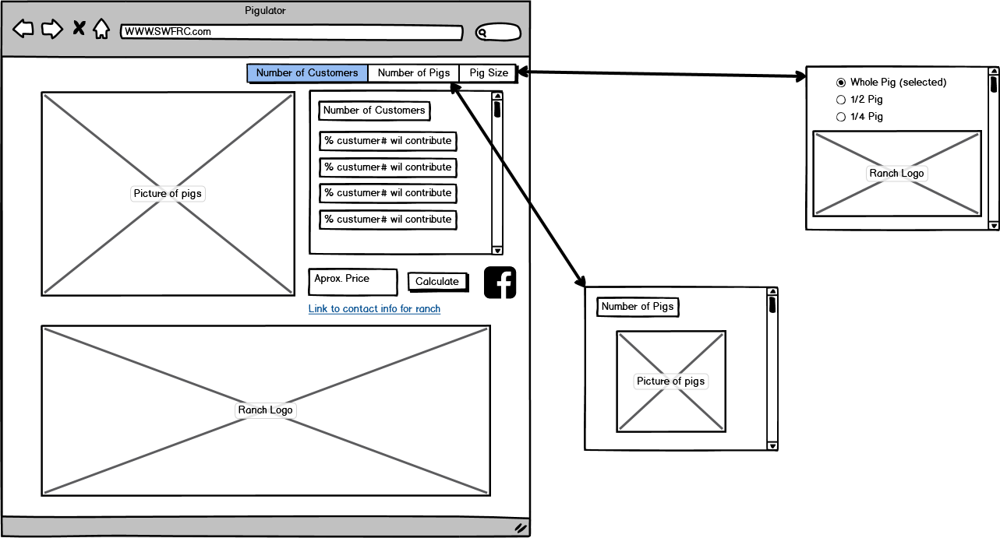
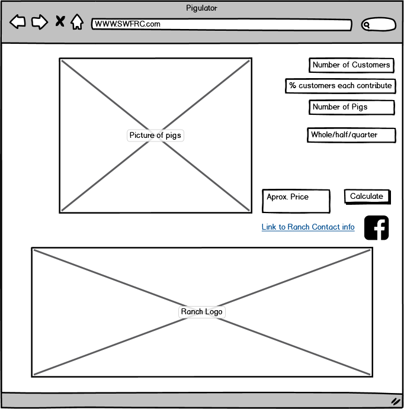

# Pigulator
[Piglulator Prototype](https://github.com/Sillymoosey/PigulatorPrototype)
---
## Concept
The Pigulator was born to solve a single issue, explaning and calculating the the price of a pig with multiple customers splitting the cost. The pigulator will allow a quick reference for customers to see roughly what the will be expected to pay and how they can lesson the cost by crowd funding a single purchase.
---
## Summary

---

The Pigulator is a price calculating tool that allows users to divid up the price of a pig for a farming website. The Pigulator will allow users to select the percentage they would like to pay, how many of them are pitching in, the number of pigs they want, and wether they want a whole pig or half a pig. While the price of a whole or half pig is a set number users may want to split the cost since organic, pasture razed pork is expensive. This calculator will be implemented on the farming website inorder to help the users make an informed decision on their perchase.  

## Table of Contents

### 1. [Use Statements](#Use-Statements)
### 2. [Use Cases](#use-cases)
### 3. [Concept Diagrams](#Concept-Diagrams)
### 4. [User Diagram](#User-Diagram)
### 5. [Requirments Table](#Requirments-Table)
### 6. [Test Table](#Test-Table)

------

## [Use Statements](#Use-Statements)

> As a restaurant I need/want high quality pork So that I can service my customer base.

> As a Rancher I need/want a way to simply show customers prices So that I can increase my sales.

> As a Consumer I need/want a way to understand the price of high quality food products So that I can make an informed decision.

---

## [Use Cases](#use-cases)

1. Given one whole pig for sale, and one customer, Ted. When Ted requests the price then the price of one pig is displayed.
2. Given two whole pigs for sale, and one customer, Billie’s BBQ. When Billie’s BBQ requests the price then the price of the two whole pigs is displayed in one combined figure.
3. Given a 1/2 pig for sale, and two customers, Cecily and Peter. When they requests the price then the price then the price each user owes for the 1/2 pig is displayed.
4. Given a whole pig for sale, and one customer, Taylor and Cyrus. When Taylor and cyrus requests the price then the price each user owes for the whole pig is displayed.

---

## [Concept Diagrams](#Concept-Diagrams)
Main Pigulator web page concept.

---
Secondary Pigulator concept.

---

## [User Diagram](#User-Diagram)
User Diagram for the Pigulator.

---

## [Requirments Table](#Requirments-Table)
|R-ID |Description |Test Type | Test-ID |
|:------|:------------:|:----------:|:---------:|
|1.0  | Calculates price of pork| Demonstration | 1 |
|1.1  | be able to calculate multiple user entries| Test | 2 |
|1.2  | be able to divide total price among multiple users| Test | 3 |
|1.2.1| be able to have users decide how much of a share they pay| Test | 4 |
|1.3  | be able to pick whole,1/2 pig amounts| Test | 5 |
|1.4  | be able to select multiple pigs to be calculated| Test | 6 |
|1.5  | be able to draw fixed stats from data table| Test | 7 |
|2.0  | Have social media connectivity| Demonstration | 8 |
|2.1  | be able to share to Facebook/Instagram | Test | 9 |
|3.0  | Connect to contact page of ranch website| Demonstrate | 10 |

---

## [Test Table](#Test-Table)
|Test-ID |Procedure |Status | R-ID |
|:------|:------------:|:----------:|:---------:|
|1  | Click Calculate button/Examin result/ unit test result|Not Tested | 1.0 |
|2 | Type how many users will purchase/ unit test result| Not Tested | 1.1 |
|3  | Unit test division result to check math| Not Tested | 1.2 |
|4| input each users percent stake in pig/ unit test percent total/ unit test division| Not Tested | 1.2.1 |
|5  | click radio button for whole or 1/2 pig/ unit test proper price charge| Not Tested | 1.3 |
|6  | user input number of pigs/ unit test result| Not Tested | 1.4  |
|7  | unit test pig stats from SQL Data Base| Not Tested | 1.5 |
|8  | click on social media button/ ensure button links to pigulator post page| Not Tested | 2.0 |
|9  | intagrate links to instagram and facebook/ ensure links to pigulator post page | Not Tested | 2.1 |
|10  | intagrate link to ranch website contact page| Not Tested | 3.0 |
